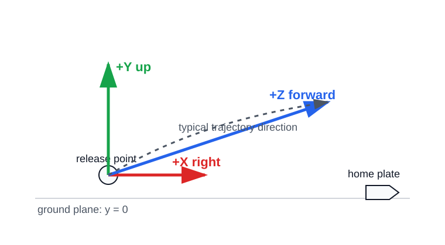
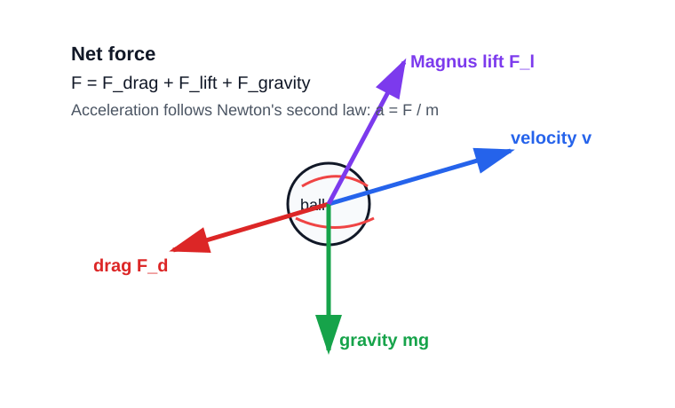
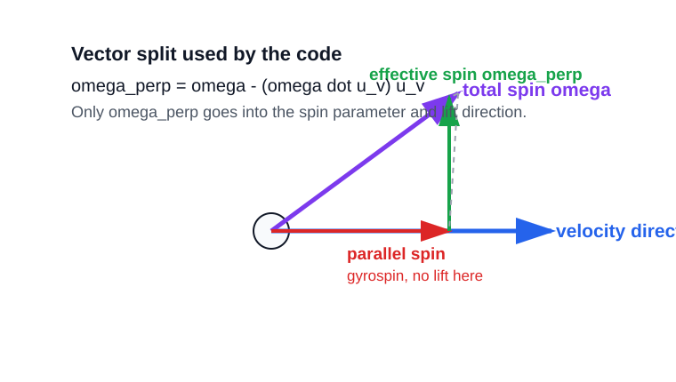

# Baseball Flight Physics Tutorial

This tutorial explains the physics and math behind `ball_flight`, then maps each idea to the corresponding code in [`src/ball_flight/simulator.py`](../src/ball_flight/simulator.py).

The level is meant to sit between advanced high school physics and early university mechanics: we will use vectors, trigonometry, Newton's second law, differential equations, and numerical integration, but each piece is introduced from the ground up.

## 1. What The Simulator Is Modeling

A pitched baseball is treated as a small rigid sphere moving through air. At every instant, the code tracks:

- position: `r = [x, y, z]`
- velocity: `v = [vx, vy, vz]`
- acceleration: `a = [ax, ay, az]`
- spin angular velocity: `omega = [omega_x, omega_y, omega_z]`

The simulator includes three forces:

1. gravity
2. aerodynamic drag
3. Magnus lift from spin

It does not model wind, spin decay, seam orientation, seam-shifted wake, ball deformation, bounces, or changing air density. Those are real effects, but this code is an idealized first model.

## 2. Coordinate System

The code uses a camera-friendly 3D coordinate system:

- `+X`: right
- `+Y`: up
- `+Z`: forward, from the pitcher toward home plate



This convention is documented at the top of [`simulator.py`](../src/ball_flight/simulator.py). It matters because signs determine whether a force moves the ball up/down, left/right, or forward/backward.

The state variables in code are stored as separate arrays:

```python
self.x, self.y, self.z
self.vx, self.vy, self.vz
self.ax, self.ay, self.az
```

Each index `i` represents one time sample. For example:

```python
position = self.get_position(i)
velocity = self.get_velocity_vector(i)
```

At the end, the arrays are packaged into a `Trajectory`:

```python
positions=np.column_stack((self.x, self.y, self.z))
velocities=np.column_stack((self.vx, self.vy, self.vz))
acceleration=np.column_stack((self.ax, self.ay, self.az))
```

## 3. From Pitch Parameters To Initial Velocity

The public input uses:

- `v0`: initial speed
- `theta`: vertical launch angle
- `phi`: horizontal launch angle

Angles are supplied in degrees, then converted to radians:

```python
self.theta = np.radians(theta)
self.phi = np.radians(phi)
```

Why radians? Most math libraries, including NumPy's `sin` and `cos`, expect radians.

The velocity components are:

```text
vz0 = v0 cos(theta) cos(phi)
vx0 = v0 cos(theta) sin(phi)
vy0 = v0 sin(theta)
```

This is ordinary 3D trigonometry:

- `sin(theta)` gives the vertical fraction of the speed.
- `cos(theta)` gives the horizontal-plane fraction.
- `sin(phi)` and `cos(phi)` split that horizontal-plane speed into X and Z.

Code:

```python
def _set_initial_velocity(self) -> None:
    self.vz0 = self.v0 * np.cos(self.theta) * np.cos(self.phi)
    self.vx0 = self.v0 * np.cos(self.theta) * np.sin(self.phi)
    self.vy0 = self.v0 * np.sin(self.theta)
```

Example: if `theta = 0`, then `sin(theta) = 0`, so the ball starts with no vertical velocity. It can still rise or fall later because forces affect acceleration.

## 4. Newton's Second Law: The Heart Of The Model

Newton's second law says:

```text
F_net = m a
```

So:

```text
a = F_net / m
```

The simulator computes forces first, then acceleration.



The net force is:

```text
F_net = F_drag + F_lift + F_gravity
```

In code, acceleration is computed in `calculate_acceleration()`:

```python
ax = (-F_d * (self.vx[i] / v) + lift_force[0]) / self.m
ay = -self.g + ((-F_d * (self.vy[i] / v) + lift_force[1]) / self.m)
az = (-F_d * (self.vz[i] / v) + lift_force[2]) / self.m
```

This deserves careful unpacking.

### Gravity

Gravity acts downward, which is negative Y in this coordinate system:

```text
a_gravity = [0, -g, 0]
```

That is why `ay` starts with:

```python
ay = -self.g + ...
```

The default value is:

```python
g = 9.81 m/s^2
```

### Drag Direction

Drag always points opposite the velocity vector.

If:

```text
v_vec = [vx, vy, vz]
|v| = speed
```

then the unit vector in the direction of motion is:

```text
u_v = v_vec / |v|
```

So the unit vector opposite motion is:

```text
-u_v = -v_vec / |v|
```

That is why each drag component uses:

```python
-F_d * (self.vx[i] / v)
-F_d * (self.vy[i] / v)
-F_d * (self.vz[i] / v)
```

The scalar `F_d` is the drag magnitude. The component formulas turn that scalar into a vector.

## 5. Quadratic Drag

Drag grows roughly with the square of speed:

```text
F_d = 1/2 rho v^2 C_d A
```

Where:

- `rho`: air density, kg/m^3
- `v`: speed, m/s
- `C_d`: drag coefficient, dimensionless
- `A`: cross-sectional area, m^2

The area of a baseball is approximated as the area of a circle:

```text
A = pi r^2
```

Code in `__init__()`:

```python
self.r = r
self.A = np.pi * r**2
```

Code for drag:

```python
def calculate_drag_magnitude(self, v: float) -> float:
    return 0.5 * self.rho * v**2 * self.C_d * self.A
```

### Why Speed Squared?

At higher speed, the ball hits more air per second and gives that air more momentum. Both effects scale with speed, so the combined drag effect is approximately proportional to `v^2`.

This is a standard model for objects moving through air at baseball speeds. It is still simplified because real baseball drag changes with seams, spin, Reynolds number, and orientation.

## 6. Spin, Angular Velocity, And RPM

Pitch spin is entered as revolutions per minute:

```python
spin_rate = 1200
```

Physics formulas usually use angular velocity in radians per second:

```text
omega = spin_rate * 2 pi / 60
```

because:

- one revolution is `2 pi` radians
- one minute is `60` seconds

Code:

```python
spin_rate_rad_s = (self.spin_rate * 2 * np.pi) / 60
```

The result is the length, or magnitude, of the angular velocity vector. The spin axis determines its direction.

## 7. Local Spin Angles To World Spin Vector

The user gives spin as:

- `spin_rate`
- `spin_elevation`
- `spin_azimuth`

The code first describes spin in a local coordinate frame attached to the initial pitch direction. Then it maps that local spin vector into the global X/Y/Z coordinate system.

This happens in `_init_spin_vector()`.

### Step 1: Normalize The Initial Velocity

The initial velocity direction is:

```text
u_v = velocity / |velocity|
```

Code:

```python
velocity = np.array([self.vx0, self.vy0, self.vz0], dtype=np.float64)
v_norm = np.linalg.norm(velocity)
u_v = velocity / v_norm
```

### Step 2: Build A Perpendicular Basis

To describe spin directions around the flight path, we need two vectors perpendicular to `u_v`.

Code:

```python
arbitrary = np.array([0, 1, 0], dtype=np.float64)
u_perp1 = np.cross(u_v, arbitrary)
...
u_perp1 /= np.linalg.norm(u_perp1)
u_perp2 = np.cross(u_v, u_perp1)
```

The cross product gives a vector perpendicular to both input vectors. If the pitch is too close to vertical, world-up would be parallel to the velocity direction, so the code switches to `[1, 0, 0]`.

### Step 3: Build The Local Spin Vector

The local vector is:

```python
omega_local = spin_rate_rad_s * np.array(
    [
        np.cos(self.spin_elevation) * np.cos(self.spin_azimuth),
        np.sin(self.spin_elevation),
        np.cos(self.spin_elevation) * np.sin(self.spin_azimuth),
    ],
    dtype=np.float64,
)
```

This is spherical-coordinate logic:

- elevation controls the up/down component
- azimuth controls rotation around the local frame
- multiplying by `spin_rate_rad_s` gives the vector its physical magnitude

### Step 4: Transform Local To Global

The three basis vectors become columns in a transformation matrix:

```python
transformation_matrix = np.column_stack((u_perp1, u_perp2, u_v))
self.omega = transformation_matrix @ omega_local
```

The `@` operator is matrix multiplication. The result, `self.omega`, is the spin vector in world coordinates.

## 8. Effective Spin Versus Gyrospin

This is one of the most important physics ideas in the simulator.

Not all spin creates lift. Only the component of spin perpendicular to the velocity contributes to Magnus lift in this model.



Let:

```text
omega = total spin vector
u_v = unit velocity direction
```

The component of spin parallel to the velocity is:

```text
omega_parallel = (omega dot u_v) u_v
```

The effective, perpendicular component is:

```text
omega_perp = omega - omega_parallel
omega_perp = omega - (omega dot u_v) u_v
```

Code:

```python
u_v = velocity / v_norm
omega_perp = self.omega - np.dot(self.omega, u_v) * u_v
```

Why does this matter?

- Spin parallel to velocity is called gyrospin.
- Gyrospin is like a football spiral.
- It changes orientation, but in this simplified model it does not create sideways or vertical lift.
- Spin perpendicular to velocity is what bends the pitch.

The method is:

```python
def calculate_effective_spin(self, velocity: FloatArray) -> FloatArray:
    ...
    omega_perp = self.omega - np.dot(self.omega, u_v) * u_v
    ...
    return omega_perp
```

## 9. Spin Parameter

The simulator uses a dimensionless spin parameter:

```text
S = |omega_perp| r / |v|
```

Where:

- `|omega_perp|`: effective angular speed, rad/s
- `r`: ball radius, m
- `|v|`: ball speed, m/s

The spin parameter compares surface speed from spin to forward speed from flight.

Code:

```python
def calculate_spin_parameter(self, v: float, effective_spin: FloatArray) -> float:
    if v <= _EPS:
        return 0.0
    return np.linalg.norm(effective_spin) * self.r / v
```

If `S` is zero, there is no effective spin-induced lift.

## 10. Lift Coefficient

The simulator converts spin parameter into a lift coefficient:

```text
C_l = 1 / (2 + sqrt(2 / S))
```

Code:

```python
def get_lift_coefficient(self, S: float) -> float:
    if S <= _EPS:
        return 0.0
    return 1 / (2 + np.sqrt(2 / S))
```

`C_l` is dimensionless. It tells the force equation how strongly spin creates lift.

This formula is a simplified empirical/analytical-style relation. It is useful for exploration, but it is not a complete modern baseball aerodynamics model.

## 11. Magnus Lift Force

The Magnus lift magnitude uses the same general dynamic-pressure pattern as drag:

```text
F_l = 1/2 rho A C_l v^2
```

Code:

```python
F_l_magnitude = 0.5 * self.rho * self.A * C_l * v**2
```

The direction comes from a cross product:

```text
lift direction = omega_perp x velocity
```

Code:

```python
lift_force_direction = np.cross(effective_spin, velocity)
```

The code then normalizes this direction:

```python
lift_force_direction /= np.linalg.norm(lift_force_direction)
```

Finally:

```python
return F_l_magnitude * lift_force_direction
```

### Why A Cross Product?

A cross product produces a vector perpendicular to two other vectors. For a spinning ball, the lift force is perpendicular to:

- the spin axis
- the velocity direction

This is why changing spin direction changes pitch movement.

## 12. Acceleration Components

Once the simulator has drag and lift, it computes acceleration.

Mathematically:

```text
a = (F_drag + F_lift) / m + [0, -g, 0]
```

Drag vector:

```text
F_drag_vec = -F_d * v_vec / |v|
```

Lift vector:

```text
F_lift_vec = calculated from Magnus effect
```

So the component equations are:

```text
ax = (-F_d vx / v + F_lift_x) / m
ay = -g + (-F_d vy / v + F_lift_y) / m
az = (-F_d vz / v + F_lift_z) / m
```

Code:

```python
def calculate_acceleration(...):
    ax = (-F_d * (self.vx[i] / v) + lift_force[0]) / self.m
    ay = -self.g + ((-F_d * (self.vy[i] / v) + lift_force[1]) / self.m)
    az = (-F_d * (self.vz[i] / v) + lift_force[2]) / self.m
    return ax, ay, az
```

## 13. Numerical Integration

The true motion is continuous. In calculus terms:

```text
velocity = derivative of position
acceleration = derivative of velocity
```

or:

```text
dr/dt = v
dv/dt = a
```

Computers simulate this by taking small time steps. The simulator uses a fixed step size `dt`.


### Semi-Implicit Euler

At each time step:

```text
v_next = v_current + a_current dt
r_next = r_current + v_next dt
```

The important detail is that position uses the updated velocity. That is why this is semi-implicit Euler rather than fully explicit Euler.

Code:

```python
next_velocity = self.calculate_next_velocity(velocity, acceleration, dt)
next_position = self.calculate_next_position(
    position,
    np.asarray(next_velocity, dtype=np.float64),
    dt,
)
```

The helper functions are simple:

```python
def calculate_next_velocity(...):
    return vx0 + ax * dt, vy0 + ay * dt, vz0 + az * dt
```

and:

```python
def calculate_next_position(...):
    return x + vx * dt, y + vy * dt, z + vz * dt
```

### What Does `dt` Do?

Smaller `dt` means:

- more time samples
- more computation
- usually better numerical accuracy

Larger `dt` means:

- fewer samples
- faster computation
- more numerical error

The default examples often use `dt = 0.005`, or 5 milliseconds.

## 14. The Simulation Loop In Code

Here is the conceptual flow inside `calculate_path()`:

1. validate inputs
2. create time and output arrays
3. store initial position and velocity
4. for each time index:
   - read current position and velocity
   - calculate speed
   - calculate drag
   - calculate effective spin
   - calculate spin parameter
   - calculate lift coefficient
   - calculate lift force
   - calculate acceleration
   - update velocity
   - update position
   - stop or interpolate if the ball hits the ground

Code skeleton:

```python
for i in range(0, num_steps):
    position = self.get_position(i)
    velocity = self.get_velocity_vector(i)
    self.v[i] = self.get_velocity_magnitude(velocity)
    v = self.v[i]

    self.F_d[i] = self.calculate_drag_magnitude(v)
    effective_spin = self.calculate_effective_spin(velocity)
    self.S[i] = self.calculate_spin_parameter(v, effective_spin)
    self.C_l[i] = self.get_lift_coefficient(self.S[i])
    self.lift_force[i] = self.calculate_lift_force(...)

    acceleration = self.calculate_acceleration(...)
    next_velocity = self.calculate_next_velocity(...)
    next_position = self.calculate_next_position(...)
```

Each diagnostic array is time-aligned. That means:

```text
time[i], positions[i], velocities[i], acceleration[i], drag_force[i], lift_force[i]
```

all describe the same sample.

## 15. Ground Impact Handling

The simulator stops if the next predicted point crosses the ground plane:

```python
if next_position[1] <= 0:
```

The ground is:

```text
y = 0
```

Because the time step is finite, the proposed point may be below ground. Instead of keeping a below-ground sample, the code interpolates between the current point and the proposed next point.

Let:

```text
y_current > 0
y_next <= 0
```

The fraction of the step needed to reach the ground is:

```text
fraction = (0 - y_current) / (y_next - y_current)
```

Then:

```text
impact_position = current_position + fraction * (next_position - current_position)
impact_velocity = current_velocity + fraction * (next_velocity - current_velocity)
impact_time = current_time + fraction * dt
```

Code:

```python
fraction = (0.0 - position_array[1]) / y_delta
impact_position = position_array + fraction * (next_position_array - position_array)
impact_position[1] = 0.0
impact_velocity = velocity + fraction * (next_velocity - velocity)
impact_time = time + fraction * dt
```

This is a linear approximation. It makes the output cleaner and physically reasonable enough for stopping the trajectory, but it is not a detailed collision model.

## 16. What The Output Means

Calling:

```python
trajectory = BallPathSimulator().calculate(params, t_max=5, dt=0.005)
```

returns a `Trajectory` object with arrays:

```python
trajectory.time
trajectory.positions
trajectory.velocities
trajectory.acceleration
trajectory.drag_force
trajectory.spin_parameter
trajectory.lift_force
trajectory.lift_coefficient
```

Shape examples:

- `positions`: `(N, 3)`
- `velocities`: `(N, 3)`
- `time`: `(N,)`
- `lift_force`: `(N, 3)`
- `lift_coefficient`: `(N,)`

The properties:

```python
trajectory.x
trajectory.y
trajectory.z
trajectory.vx
trajectory.vy
trajectory.vz
```

are convenience views into the columns.

## 17. Worked Mini Example

Suppose:

```python
params = PitchParameters(
    v0=42,
    theta=0,
    phi=2,
    spin_rate=1200,
    spin_elevation=180,
    spin_azimuth=0,
    x0=-0.5,
    y0=1.6,
    z0=0,
)
```

Interpretation:

- initial speed: `42 m/s`, about `94 mph`
- vertical launch angle: `0 degrees`
- horizontal angle: `2 degrees` to the right
- spin: `1200 rpm`
- release point: slightly left of center, 1.6 m high, z = 0

The simulator converts the velocity:

```text
vz0 = 42 cos(0) cos(2 deg)
vx0 = 42 cos(0) sin(2 deg)
vy0 = 42 sin(0)
```

Approximate values:

```text
vz0 ≈ 41.97 m/s
vx0 ≈ 1.47 m/s
vy0 = 0 m/s
```

Then every 0.005 seconds, it recomputes the forces and advances the state.

## 18. How The Main Calculations Map To Code

| Physics idea | Equation | Code location |
| --- | --- | --- |
| Cross-sectional area | `A = pi r^2` | `__init__()` |
| Initial velocity components | `vx0, vy0, vz0` from `v0`, `theta`, `phi` | `_set_initial_velocity()` |
| RPM to rad/s | `omega = rpm * 2 pi / 60` | `_init_spin_vector()` |
| Effective spin | `omega_perp = omega - (omega dot u_v) u_v` | `calculate_effective_spin()` |
| Spin parameter | `S = |omega_perp| r / |v|` | `calculate_spin_parameter()` |
| Lift coefficient | `C_l = 1 / (2 + sqrt(2 / S))` | `get_lift_coefficient()` |
| Drag magnitude | `F_d = 0.5 rho v^2 C_d A` | `calculate_drag_magnitude()` |
| Lift magnitude | `F_l = 0.5 rho A C_l v^2` | `calculate_lift_force()` |
| Drag direction | `-v_vec / |v|` | `calculate_acceleration()` |
| Lift direction | `omega_perp x velocity` | `calculate_lift_force()` |
| Newton's second law | `a = F / m` | `calculate_acceleration()` |
| Velocity update | `v_next = v + a dt` | `calculate_next_velocity()` |
| Position update | `r_next = r + v_next dt` | `calculate_next_position()` and `calculate_path()` |
| Ground interpolation | linear solve for `y = 0` | `_interpolate_ground_impact()` |

## 19. Why The Model Is Useful

This model is useful because it captures the big qualitative effects:

- faster pitches experience more drag;
- spin can bend the ball through Magnus lift;
- gyrospin does not create much movement in this simplified model;
- gravity pulls the ball down;
- timestep integration turns continuous physics into usable arrays.

It is especially good for:

- teaching the physics of flight;
- generating plausible trajectories;
- comparing spin and no-spin cases;
- exporting paths to visualization tools like Blender;
- building intuition before using more advanced aerodynamics.

## 20. What Would Make It More Advanced?

A more advanced baseball simulator could add:

- speed-dependent drag coefficient;
- spin decay;
- wind;
- seam orientation;
- seam-shifted wake forces;
- ball orientation/quaternion state;
- pitch-specific calibrated coefficients;
- RK4 or adaptive ODE integration;
- plate-crossing interpolation in addition to ground impact;
- uncertainty models for measured camera data.

The current code is a clean foundation for those additions because the physics core is now separate from plotting and scene tools.

